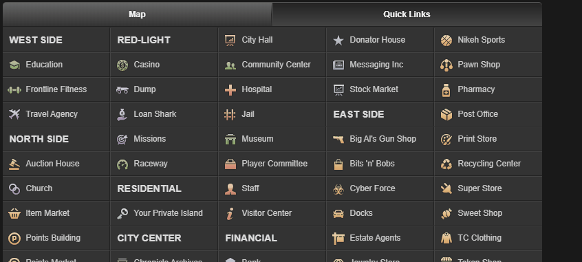

# About this project
## Introduction
This project is a demo automation in python for the browser MMO game Torn City, created for study purposes only.

## How it works
The objective of this automation is to make a profit by buying items sold by other players 
at a price lower than the NPC market sell price and reselling them there.

## How to run it

0 - Install python on your machine   
0.1 - In the game, 'Settings' > 'Navigation settings' > change Item Market label to first link    
1 - In code put attribute value to this variables `browserName` `email` `pwd`   
2 - Run the `automation.py` script  
3 - The script was built using a 1366x768 resolution. The `mouseaux.py` script is useful for adjusting
the component positions in `automation.py`   
  
Note: This is a simplest demo version. Remember the Rules of the game, and by using this script, the responsibility is yours.

